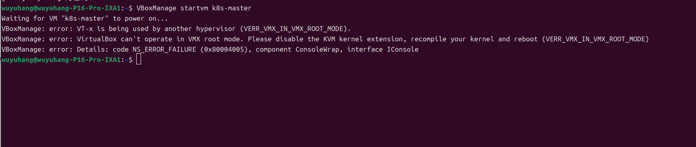

```markdown
# KVM与VirtualBox冲突排错

**现象**：
执行 `VBoxManage startvm k8s-master` 时报错：
`VT-x is being used by another hypervisor (VERR_VMX_IN_VMX_ROOT_MODE)`

**根本原因**：
KVM和VirtualBox都在争抢CPU的VT-x硬件虚拟化功能，同一时间只能有一个hypervisor占用。

**解决方案**：
sudo modprobe -r kvm_intel kvm  #临时卸载KVM内核模块
echo "blacklist kvm" | sudo tee /etc/modprobe.d/blacklist-kvm.conf  #创建KVM模块黑名单配置                  输出 blacklisrt kvm
echo "blacklist kvm_intel" | sudo tee -a /etc/modprobe.d/blacklist-kvm.conf  #追加Inter KVM模块黑名单规则   输出 blacklist kvm_intel

**核心认知**
这是云原生中“资源隔离”问题的微缩版。k8s调度器每天都在做的，就是决定哪个Pod能用哪些CPU/GPU,同时确保不冲突。
```