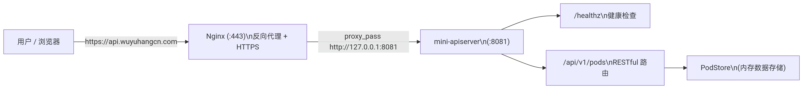

```markdown
# Mini API Server (K8s Style)

## 项目简介
这是一个用 Go 语言实现的轻量级 Kubernetes API Server 模拟服务。它严格遵循 K8s 声明式 API 设计，实现了 Pod 资源的完整生命周期管理（增删改查）、参数校验和健康检查，旨在深入理解 K8s 控制平面的核心工作原理。
本服务为纯 API 后端，已通过二进制文件直接在阿里云 ECS 上完成生产级部署，核心接口通过公网 HTTPS 稳定运行。

## 快速访问
- **健康检查**: `https://api.wuyuhangcn.com/healthz`
- **API 端点**: `https://api.wuyuhangcn.com/api/v1/pods`
- HTTP 流量 (80) 自动重定向到 HTTPS (443)

## 技术栈
- **后端语言**：Go 1.22
- **部署方式**：裸机二进制直接运行 (`nohup` 守护)
- **反向代理**：Nginx (负责 HTTPS 终结与反向代理)
- **安全证书**：Let's Encrypt (全自动申请与续期)
- **运行环境**：Ubuntu 24.04 LTS on Alibaba Cloud ECS

## 核心接口
| 方法 | 路径 | 功能 | 业务校验 |
| :--- | :--- | :--- | :--- |
| `GET` | `/healthz` | 服务健康检查 | 无 |
| `GET` | `/api/v1/pods` | 列出所有 Pod | 无 |
| `POST` | `/api/v1/pods` | 创建一个 Pod | 需提供 `name`、`namespace` |
| `DELETE` | `/api/v1/pods?name=...&namespace=...` | 删除指定 Pod | 需提供 `name`、`namespace` |

## 综合演示（推荐脚本）
此脚本展示了服务从空状态到完整闭环的验证逻辑，建议直接复制到终端运行。
```bash
# 1. 健康检查
curl -i https://api.wuyuhangcn.com/healthz

# 2. 查询初始状态（预期为空数组）
curl -i https://api.wuyuhangcn.com/api/v1/pods

# 3. 创建一个 Pod
curl -i -X POST https://api.wuyuhangcn.com/api/v1/pods \
  -H "Content-Type: application/json" \
  -d '{"name":"demo-pod","image":"nginx:alpine","namespace":"default"}'

# 4. 再次查询（验证创建成功）
curl -i https://api.wuyuhangcn.com/api/v1/pods

# 5. 异常演示（参数缺失，触发 400 校验）
curl -i -X POST https://api.wuyuhangcn.com/api/v1/pods \
  -H "Content-Type: application/json" \
  -d '{"namespace":"test"}'

# 6. 删除 Pod
curl -i -X DELETE "https://api.wuyuhangcn.com/api/v1/pods?name=demo-pod&namespace=default"
```

本地开发与运行

```bash
# 1. 启动服务
go run main.go

# 2. 验证
curl http://localhost:8081/healthz
```

生产环境部署（二进制部署）

本项目最新版采用裸机二进制部署，流程如下：

1. 编译:
   ```bash
   CGO_ENABLED=0 GOOS=linux GOARCH=amd64 go build -o mini-apiserver main.go
   ```
2. 上传:
   ```bash
   scp -i ~/.ssh/你的密钥 ./mini-apiserver root@你的服务器IP:/tmp/
   ```
3. 上线:
   ```bash
   ssh -i ~/.ssh/你的密钥 root@你的服务器IP
   cp /root/mini-apiserver /root/mini-apiserver.bak  # 备份旧版
   pkill -f mini-apiserver
   cp /tmp/mini-apiserver /root/mini-apiserver
   nohup /root/mini-apiserver > /var/log/mini-apiserver.log 2>&1 &
   ```

注：项目初期也使用过 Docker 多阶段构建，详见旧版提交记录。

架构设计



设计映射：

· PodStore + map[string]Pod: 模拟 K8s 的 etcd，作为内存态数据存储。
· handlePods 路由分发: 模拟 K8s API Server 的路由层，根据 HTTP Method 分发。
· sync.RWMutex: 实现高并发读写安全，契合“读多写少”场景。
· /healthz: 无状态健康检查，是集群判断服务存活的标准接口。

技术亮点

1. 并发安全的内存存储

```go
type PodStore struct {
    mu   sync.RWMutex  // 读写锁，读并发，写安全
    pods map[string]Pod
}
func (s *PodStore) listPods(w http.ResponseWriter, _ *http.Request) {
    s.mu.RLock()         // 读锁
    defer s.mu.RUnlock()
    // ...
}
```

2. 严谨的 RESTful 规范

· 状态码严格区分:
  · 200 OK: 查询成功
  · 201 Created: 创建成功
  · 400 Bad Request: 参数校验失败
  · 404 Not Found: 删除或查询不存在的资源
  · 409 Conflict: 创建重复资源
· 参数显式校验: 强制要求必填字段 (name、namespace)，模仿 K8s 的准入控制。

3. 无状态设计思想

· /healthz 不依赖任何外部存储或复杂逻辑，仅返回服务进程存活状态。
· 符合云原生单体服务设计，便于监控告警和弹性扩缩。

演进方向与 K8s 映射

+--------------------+---------------------------------------+---------------------------------------+
| 演进方向          | 当前实现                              | K8s 对应方案                          |
+====================+=======================================+=======================================+
| 状态持久化        | 内存 map，服务重启数据丢失           | etcd (持久化存储)                     |
+--------------------+---------------------------------------+---------------------------------------+
| 资源控制          | 纯 API 资源管理 (当前已具备)         | API Server + Scheduler + Kubelet      |
+--------------------+---------------------------------------+---------------------------------------+
| 认证授权          | 无（当前为演示环境）                  | RBAC + Admission Control              |
+--------------------+---------------------------------------+---------------------------------------+
| 资源版本控制      | 无                                    | etcd ModRevision (乐观锁)             |
+--------------------+---------------------------------------+---------------------------------------+
| 事件推送          | 无                                    | etcd Watch 机制                       |
+--------------------+---------------------------------------+---------------------------------------+

```
